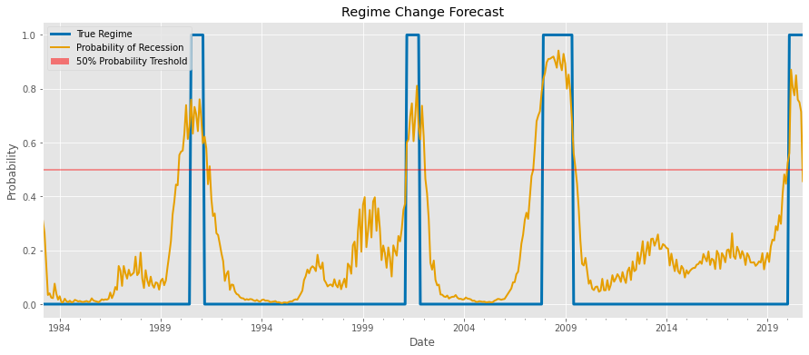
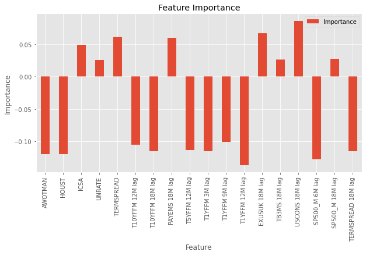

# regime-change
# Summary
I am forecasting US recessions based on macroeconomic indicators from 1984-2020
# Results
Logistic Regression model trained on 1984-2009 data forecasted 2020 recession 1 month in advance of the official data from FRED
<br>

<br>
## The Model
I have used Logistic Regression model with l2 penalty trained on 1984-2009 data forecasting 2020 recession. I have also assigned a higher weight to recession class to account for inbalanced data.
<br>
Splitting data into train and test set (data up to the end of 2009):
```python
df_train = df[:322].drop(['Date', 'Regime'], axis=1)
df_train_targ = df.iloc[:322, 1]
df_test = df[323:].drop(['Date', 'Regime'], axis=1)
df_test_targ = df.iloc[323:, 1]
```
Fitting the model into Train set and forecasting Test set:
```python
model=LogisticRegression(C=0.029, penalty='l2', class_weight={0: 0.15, 1: 0.85}) # high weight to recession 
LR=model.fit(df_train,df_train_targ)
training_predictions=LR.predict(df_train)
predictions=LR.predict(df_test)
prob_predictions = LR.predict_proba(df_test)
print(f'Accuracy Score: {accuracy_score(df_test_targ,predictions)}')
print(f'Confusion Matrix: \n{confusion_matrix(df_test_targ, predictions)}')
print(f'Area Under Curve: {roc_auc_score(df_test_targ, predictions)}')
print(f'Recall score: {recall_score(df_test_targ,predictions)}')
print(f'Precision score: {precision_score(df_test_targ,predictions)}')
```
Accuracy Score: 0.9844961240310077<br>
Confusion Matrix: <br>
[[119   1]<br>
 [  1   8]]<br>
Area Under Curve: 0.9402777777777778<br>
Recall score: 0.8888888888888888<br>
Precision score: 0.8888888888888888<br>
## Macroeconomic indicators (Features)
After running the model for the first time and extracting features importance I selected the following indicators picking the ones with low correlation:
<br>
| Bucket                          | Indicator  | Details                                           |
|---------------------------------|------------|---------------------------------------------------|
| Bond Market and Monetary Policy | T1YFFM     | 1-Year Treasury C Minus FEDFUNDS                  |
| Bond Market and Monetary Policy | TERMSPREAD | Term Spread (10-year T-bill minus 3-month T-bill) |
| Bond Market and Monetary Policy | T10YFFM    | 10-Year Treasury C Minus FEDFUNDS                 |
| Bond Market and Monetary Policy | T5YFFM     | 5-Year Treasury C Minus FEDFUNDS                  |
| Real Estate Market              | HOUST      | Housing Starts: Total New Privately Owned         |
| Employment                      | AWOTMAN    | Avg Weekly Overtime Hours : Manufacturing         |
| Employment                      | ICSA       | Initial Claims, Monthly                           |
| Employment                      | UNRATE     | Unemployment Rate                                 |
| Economic growth                 | SP500      | Index Growth                                      |
| Foreign Exchange                | EXUSUK     | U.S. / U.K. Foreign Exchange Rate                 |

<br>
The positive scores indicate a feature that predicts class 1, whereas the negative scores indicate a feature that predicts class 0<br>
### Feature extraction and resampling
```python
recession = mitk.recession_nber() #monthly
T10YFFM_d = mitk.tenyear_cm_minus_fedfunds() #monthly
TB3SMFFM_d = mitk.three_month_tbill_minus_fedfunds() #monthly
PAYEMS_d = mitk.all_employee() #monthly
JTSJOL_d = mitk.job_open() #monthly
T5YFFM_d = mitk.five_year_cm_minus_fedfund() #monthly
T1YFFM_d = mitk.one_year_cm_minus_fedfund() #monthly
EXUSUK_d = mitk.us_uk_fx() #monthly
HOUSTW_d = mitk.housing_stats_west_census() #monthly
TB3MS_d = mitk.three_month_trs_secondary() #monthly
USCONS_d = mitk.employee_constr() #monthly
AWOTMAN_d = mitk.overtime_manuf() #monthly
HOUST_d = mitk.housing_owened() #monthly
DMANEMP_d = mitk.employee_durable() #monthly
SRVPRD_d = mitk.employee_service() #monthly
ICSA_d = mitk.initial_claims() #daily
ICSA_d = ICSA_d.resample('M').mean() #resampling daily to monthly
UNRATE_d = mitk.unemployment_rate_us() #monthly
sp500 = fltk.hist_returns(['^GSPC']) #daily
sp500_m = (1+sp500).resample('M').prod()-1 #resampling daily to monthly
sp500_m = sp500_m.rename(columns={'^GSPC': 'SP500_M'}) #changing column name
termspread = mitk.spread_tenyr_threemon_tr() #daily
termspread = termspread.resample('M').mean() #resampling daily to monthly
gdp = mitk.gdp_us() #quaterly
gdp = gdp.resample('M').mean() #resampling quaterly to monthly
gdp = gdp.interpolate(method='nearest') #interpolating gaps
gdp = gdp.pct_change() #percent change
```
Data is pulled from FRED using their API. All functions are located in macro_indicators_toolkit.py file.
Sample function:
```python
def three_month_trs_secondary():
    """
    3-Month Treasury Bill: Secondary Market Rate, Monthly
    """
    threems = fred.get_series('TB3MS')
    threems.dropna(inplace=True)
    threems = threems.rename('TB3MS')
    return threems
```
I have added 3, 6, 9, 12 and 18 months lags to each feature to enhance the model prediction capabilities:
```python
# Add lags
for col in bigmacro.drop(['USREC'], axis=1):
    for n in [3,6,9,12,18]:
        bigmacro['{} {}M lag'.format(col, n)] = bigmacro[col].shift(n).ffill().values

# 1 month ahead prediction
bigmacro["USREC"]=bigmacro["USREC"].shift(-1)
# dropping columns with missing values
bigmacro=bigmacro.dropna(axis=0)
```
I have standartized the data to adjust for different scales:
```python
# Standardize
from sklearn.preprocessing import StandardScaler
features=bigmacro.drop(['USREC'],axis=1)
col_names=features.columns

scaler=StandardScaler()
scaler.fit(features)
standardized_features=scaler.transform(features)
standardized_features.shape
df=pd.DataFrame(data=standardized_features,columns=col_names)
df.insert(loc=0,column="Date", value=bigmacro.index)
df.insert(loc=1,column='Regime', value=bigmacro['USREC'].values)
df.head()
```
