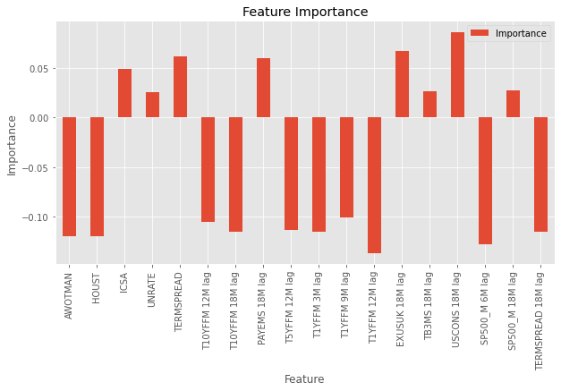

# regime-change
# Summary
I am forecasting US recessions based on macroeconomic indicators from 1984-2020
# Results
Logistic Regression model trained on 1984-2009 data forecasted 2020 recession 1 month in advance of the official data from FRED
 

 
## Macroeconomic indicators
After running the model for the first time and extracting features importance I selected the following indicators picking the ones with low correlation:
 
| Bucket                          | Indicator  | Details                                           |
|---------------------------------|------------|---------------------------------------------------|
| Bond Market and Monetary Policy | T1YFFM     | 1-Year Treasury C Minus FEDFUNDS                  |
| Bond Market and Monetary Policy | TERMSPREAD | Term Spread (10-year T-bill minus 3-month T-bill) |
| Bond Market and Monetary Policy | T10YFFM    | 10-Year Treasury C Minus FEDFUNDS                 |
| Bond Market and Monetary Policy | T5YFFM     | 5-Year Treasury C Minus FEDFUNDS                  |
| Real Estate Market              | HOUST      | Housing Starts: Total New Privately Owned         |
| Employment                      | AWOTMAN    | Avg Weekly Overtime Hours : Manufacturing         |
| Employment                      | ICSA       | Initial Claims, Monthly                           |
| Employment                      | UNRATE     | Unemployment Rate                                 |
| Economic growth                 | SP500      | Index Growth                                      |
| Foreign Exchange                | EXUSUK     | U.S. / U.K. Foreign Exchange Rate                 |
 

